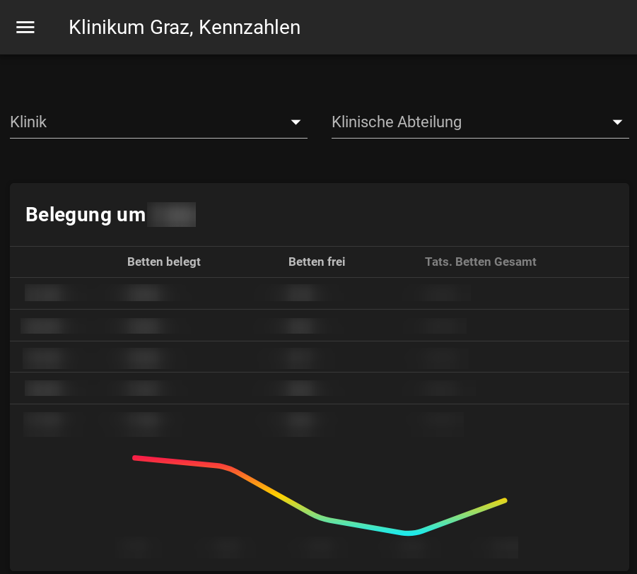

# Klinikum Graz Key Figures




## Project setup

### Install dev & build tools

```bash
npm install -g firebase-tools @vue/cli
```

### Install dependencies

```bash
npm install
```

### Compiles and hot-reloads for development

```bash
npm run serve
npm run serve-firebase
```

### Builds and deploys to development project

```bash
npm run deploy-dev
```

### Builds and deploys to production project

```bash
npm run deploy-prod
```

### Lints and fixes files

```bash
npm run lint
```
